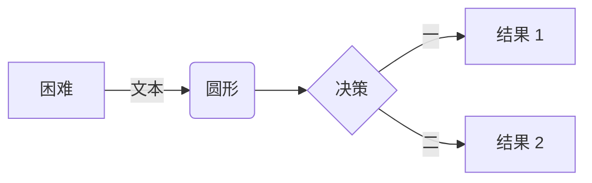

# Markdown 示例文档

## 一、文本格式

### 1. 标题层级

# 一级标题

## 二级标题

### 三级标题

#### 四级标题

##### 五级标题

###### 六级标题

### 2. 文本样式

- **加粗文本**：`**加粗文本**`
- *斜体文本*：`*斜体文本*`
- ***加粗斜体文本***：`***加粗斜体文本***`
- ~~删除线文本~~：`~~删除线文本~~`
- <u>下划线文本</u>：`<u>下划线文本</u>`
- `代码样式文本`：`` `代码样式文本` ``

## 二、列表

### 1. 有序列表

1. 第一项内容
2. 第二项内容
   1. 子项1
   2. 子项2
3. 第三项内容

### 2. 无序列表

- 项目A
- 项目B
  - 子项目B1
  - 子项目B2
- 项目C

### 3. 任务列表

- [x] 已完成任务
- [ ] 未完成任务1
- [ ] 未完成任务2

## 三、引用

> 这是一级引用
>> 这是二级引用
>>> 这是三级引用

## 四、代码块

```python
# 这是Python代码示例
def hello_world():
    print("Hello, Markdown!")

if __name__ == "__main__":
    hello_world()
```

```javascript
// 这是JavaScript代码示例
function greet() {
    console.log("Hello, World!");
}
greet();
```

## 五、表格

| 姓名 | 年龄 | 职业       |
|------|------|------------|
| 张三 | 25   | 程序员     |
| 李四 | 30   | 设计师     |
| 王五 | 35   | 产品经理   |

## 六、链接与图片

### 1. 链接

- [Markdown 官方文档](https://www.markdownguide.org/)
- <https://www.example.com>（自动链接）

### 2. 图片


*图片下方可以添加说明文字*

## 七、分割线

---

## 八、脚注

这里有一个脚注引用[^1]

[^1]: 这是脚注的内容

## 九、数学公式（需支持MathJax）

行内公式：$E=mc^2$

块级公式：
$$
\sum_{i=1}^n i = \frac{n(n+1)}{2}
$$

## 十、定义列表

术语1
: 术语1的解释内容

术语2
: 术语2的第一条解释
: 术语2的第二条解释

## 十一、流程图


